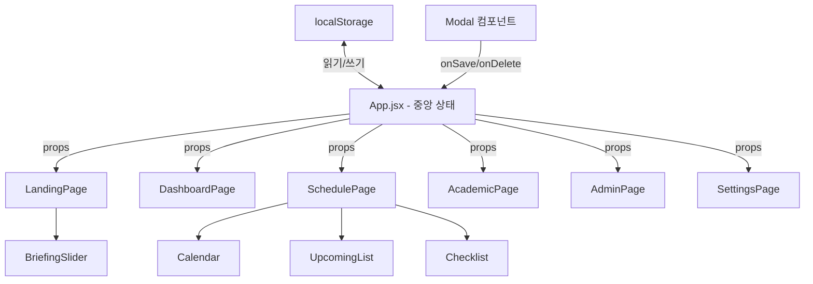

# 설계 문서: 사용자 맞춤형 대시보드

## 개요

현재 AI 학생 비서 앱은 모든 데이터(프로필, 일정, 체크리스트, 학업, 행정, 브리핑)가 각 컴포넌트 내부에 하드코딩되어 있다. 이 설계는 모든 하드코딩된 데이터를 사용자가 CRUD(생성, 읽기, 수정, 삭제) 할 수 있도록 전환하고, localStorage를 통해 영속적으로 저장하는 구조를 정의한다.

핵심 변경 사항:
- App.jsx에서 중앙 집중식 상태 관리 (useState + localStorage 동기화)
- 데이터 CRUD를 위한 모달 컴포넌트 도입
- 각 페이지/컴포넌트가 props로 데이터를 수신하도록 변경
- 설정 페이지 신규 추가
- 빈 상태 화면(empty state) UI 추가

## 아키텍처

### 상태 관리 전략

기존 아키텍처 패턴(라우터 없음, 상태 관리 라이브러리 없음)을 유지하면서, App.jsx를 데이터의 단일 진실 공급원(single source of truth)으로 활용한다.



### 데이터 흐름

1. 앱 초기화 시 localStorage에서 각 도메인 데이터를 읽어 useState로 초기화
2. 각 페이지는 props로 데이터와 핸들러(onAdd, onUpdate, onDelete)를 수신
3. 핸들러 호출 시 useState 업데이트 → useEffect로 localStorage 동기화
4. 모달 컴포넌트는 추가/수정 폼을 제공하며, 저장 시 부모의 핸들러를 호출

### 커스텀 훅: useLocalStorage

localStorage 동기화 로직을 재사용 가능한 커스텀 훅으로 추출한다.

```javascript
function useLocalStorage(key, initialValue) {
  const [value, setValue] = useState(() => {
    try {
      const stored = localStorage.getItem(key)
      return stored ? JSON.parse(stored) : initialValue
    } catch {
      return initialValue
    }
  })

  useEffect(() => {
    localStorage.setItem(key, JSON.stringify(value))
  }, [key, value])

  return [value, setValue]
}
```

## 컴포넌트 및 인터페이스

### 신규 컴포넌트

| 컴포넌트 | 위치 | 역할 |
|----------|------|------|
| `useLocalStorage` | `src/hooks/useLocalStorage.js` | localStorage 동기화 커스텀 훅 |
| `Modal` | `src/components/Modal.jsx` | 범용 모달 오버레이 (children 기반) |
| `Toast` | `src/components/Toast.jsx` | 저장/삭제 피드백 토스트 메시지 |
| `EmptyState` | `src/components/EmptyState.jsx` | 데이터 없을 때 안내 UI |
| `SettingsPage` | `src/pages/SettingsPage.jsx` | 설정 및 데이터 초기화 페이지 |
| `ProfileForm` | `src/components/ProfileForm.jsx` | 프로필 편집 모달 폼 |
| `ScheduleForm` | `src/components/ScheduleForm.jsx` | 일정 추가/수정 모달 폼 |
| `SubjectForm` | `src/components/SubjectForm.jsx` | 과목 추가/수정 모달 폼 |
| `AssignmentForm` | `src/components/AssignmentForm.jsx` | 과제 추가/수정 모달 폼 |
| `ActivityForm` | `src/components/ActivityForm.jsx` | 활동/공모전 추가/수정 모달 폼 |
| `BriefingForm` | `src/components/BriefingForm.jsx` | 브리핑 추가/수정 모달 폼 |
| `ConfirmDialog` | `src/components/ConfirmDialog.jsx` | 삭제 확인 대화상자 |

### 기존 컴포넌트 변경

| 컴포넌트 | 변경 내용 |
|----------|----------|
| `App.jsx` | useLocalStorage 훅으로 6개 도메인 상태 관리, 설정 페이지 라우트 추가 |
| `LandingPage.jsx` | profile/briefings를 props로 수신, 브리핑 관리 버튼 추가 |
| `DashboardPage.jsx` | 모든 데이터를 props로 수신, 동적 요약 카드 렌더링 |
| `SchedulePage.jsx` | schedules/checklist를 props로 수신, 추가/수정/삭제 핸들러 |
| `AcademicPage.jsx` | subjects/assignments를 props로 수신, 추가/수정/삭제 핸들러 |
| `AdminPage.jsx` | activities/contests를 props로 수신, 추가/수정/삭제 핸들러 |
| `Calendar.jsx` | EVENT_DATES 하드코딩 제거, schedules props로 이벤트 날짜 계산 |
| `UpcomingList.jsx` | upcomingData 하드코딩 제거, schedules props로 수신 |
| `Checklist.jsx` | INITIAL 하드코딩 제거, items/onToggle/onAdd/onDelete props로 수신 |
| `BriefingSlider.jsx` | 빈 배열 처리 추가, 브리핑 관리 진입점 추가 |

### 주요 인터페이스 (Props)

```
App.jsx:
  - useLocalStorage('profile', defaultProfile) → [profile, setProfile]
  - useLocalStorage('schedules', []) → [schedules, setSchedules]
  - useLocalStorage('checklist', []) → [checklist, setChecklist]
  - useLocalStorage('subjects', []) → [subjects, setSubjects]
  - useLocalStorage('assignments', []) → [assignments, setAssignments]
  - useLocalStorage('activities', []) → [activities, setActivities]
  - useLocalStorage('contests', []) → [contests, setContests]
  - useLocalStorage('briefings', []) → [briefings, setBriefings]
```

```
Modal props:
  - isOpen: boolean
  - onClose: () => void
  - title: string
  - children: ReactNode

ConfirmDialog props:
  - isOpen: boolean
  - message: string
  - onConfirm: () => void
  - onCancel: () => void

EmptyState props:
  - icon: string (이모지)
  - message: string
  - actionLabel: string
  - onAction: () => void

Toast props:
  - message: string
  - type: 'success' | 'error'
  - visible: boolean
```


## 데이터 모델

### localStorage 키 구조

각 도메인 데이터는 독립된 키로 저장된다. 모든 값은 JSON 문자열로 직렬화된다.

| localStorage 키 | 타입 | 설명 |
|-----------------|------|------|
| `app_profile` | Object | 사용자 프로필 정보 |
| `app_schedules` | Array | 일정 목록 |
| `app_checklist` | Array | 체크리스트 항목 목록 |
| `app_subjects` | Array | 과목 목록 (학점, 시험 포함) |
| `app_assignments` | Array | 과제 목록 |
| `app_activities` | Array | 교내외 활동 목록 |
| `app_contests` | Array | 공모전 목록 |
| `app_briefings` | Array | 브리핑 메시지 목록 |

### 데이터 스키마

```
Profile {
  name: string          // 이름 (필수)
  university: string    // 대학교 (필수)
  department: string    // 학과
  year: number          // 학년 (1-6)
  gpa: number           // 현재 학점
  gpaMax: number        // 최대 학점 (기본 4.5)
  credits: number       // 이수 학점
  creditsMax: number    // 졸업 학점 (기본 130)
  emoji: string         // 프로필 이모지 (기본 '😊')
}

Schedule {
  id: string            // crypto.randomUUID()
  date: string          // 'YYYY-MM-DD' 형식
  time: string          // 'HH:MM' 형식
  title: string         // 일정 제목 (필수)
  tag: string           // '수업' | '과제' | '시험' | '팀플' | '활동'
  tagClass: string      // 'purple' | 'blue' | 'red' | 'gray' | 'green'
}

ChecklistItem {
  id: string            // crypto.randomUUID()
  text: string          // 항목 텍스트 (필수)
  done: boolean         // 완료 여부
}

Subject {
  id: string            // crypto.randomUUID()
  name: string          // 과목명 (필수)
  grade: number         // 학점 (0.0 - 4.5)
  examDate: string      // 시험일 'YYYY-MM-DD' (선택)
  examScope: string     // 시험 범위 (선택)
  examStatus: string    // '진행중' | '예정' | '완료'
}

Assignment {
  id: string            // crypto.randomUUID()
  name: string          // 과제명 (필수)
  subject: string       // 관련 과목명
  deadline: string      // 마감일 'YYYY-MM-DD'
  progress: number      // 진행률 0-100
}

Activity {
  id: string            // crypto.randomUUID()
  icon: string          // 이모지 아이콘
  name: string          // 활동명 (필수)
  desc: string          // 설명
  tag: string           // '동아리' | '공모전' | '봉사' | '학회'
  tagClass: string      // 'purple' | 'blue' | 'green' | 'gray'
}

Contest {
  id: string            // crypto.randomUUID()
  name: string          // 공모전명 (필수)
  schedule: string      // 일정 설명
  reward: string        // 상금/혜택
  tags: Array<{label: string, tagClass: string}>
}

Briefing {
  id: string            // crypto.randomUUID()
  time: string          // 시간 라벨 (예: '오전 브리핑 · 09:00')
  msg: string           // 메시지 내용 (필수)
}
```

### 태그-색상 매핑

일정 태그와 CSS 클래스의 매핑은 상수로 관리한다:

```javascript
const TAG_OPTIONS = [
  { label: '수업', tagClass: 'purple' },
  { label: '과제', tagClass: 'gray' },
  { label: '시험', tagClass: 'red' },
  { label: '팀플', tagClass: 'blue' },
  { label: '활동', tagClass: 'green' },
]

const ACTIVITY_TAG_OPTIONS = [
  { label: '동아리', tagClass: 'purple' },
  { label: '공모전', tagClass: 'blue' },
  { label: '봉사', tagClass: 'green' },
  { label: '학회', tagClass: 'gray' },
]
```

### ID 생성 전략

모든 엔티티의 고유 ID는 `crypto.randomUUID()`를 사용한다. 이는 모든 모던 브라우저에서 지원되며, 외부 라이브러리 없이 충돌 없는 고유 ID를 생성한다.

### 대시보드 요약 카드 데이터 파생 로직

대시보드의 요약 카드는 저장된 데이터에서 파생된다:

- **일정 요약**: `schedules`를 날짜순 정렬 후 오늘 이후 가장 가까운 3건 추출
- **학업 요약**: `assignments`에서 진행중(progress < 100) 항목과 `subjects`에서 다가오는 시험을 합쳐 최대 3건
- **행정 요약**: `activities`와 `contests`를 합쳐 최근 등록순 최대 3건
- **주간 요약 필**: 이번 주(월~일) 범위의 과제 마감 수 + 시험 수 계산
- **평균 학점**: `subjects` 배열의 grade 평균 자동 계산

### 체크리스트 정렬 로직

체크리스트는 미완료 항목을 상단에, 완료 항목을 하단에 표시한다. 각 그룹 내에서는 원래 추가 순서를 유지한다.
